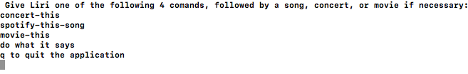
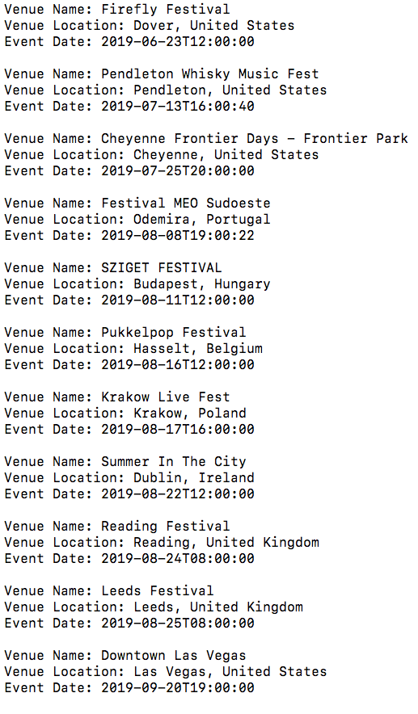
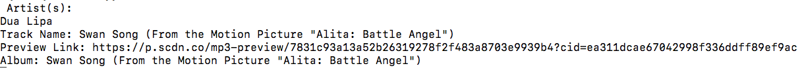
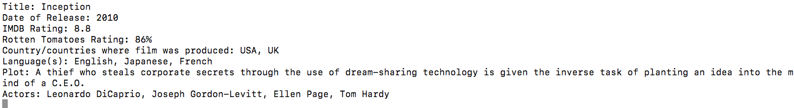
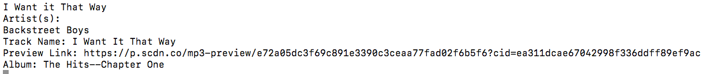
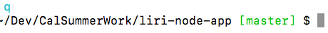

# liri-node-app
Interactive command-line application that responds to commands

## Project Description
Bot that allows users to search for upcoming events for a particular artist, details about a particular song, information about a movie, or a random preset spotify song 

### App Flow of Control
The user is given a menu in the following form

)

Now let's walk through each of the available options

Typing in "concert-this Post Malone" to the terminal produces a list of upcoming events

)

If we now type in "spotify-this-song Dua Lipa," we get (where the preview link directs you to a 30 second clip)

)

The last complex comand is movie-this, where "movie-this Inception gives us the following output"

)

The do-what-it says command uses the Spotify API to look up the song on the random.txt, which for outputs 

)

Finally, we can press q to quit the entire application. 

)

### Technologies Used

javascript, npmjs, inquirer package, axios package, Spotify API, omdb API, rest API